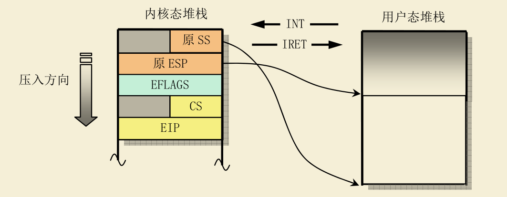
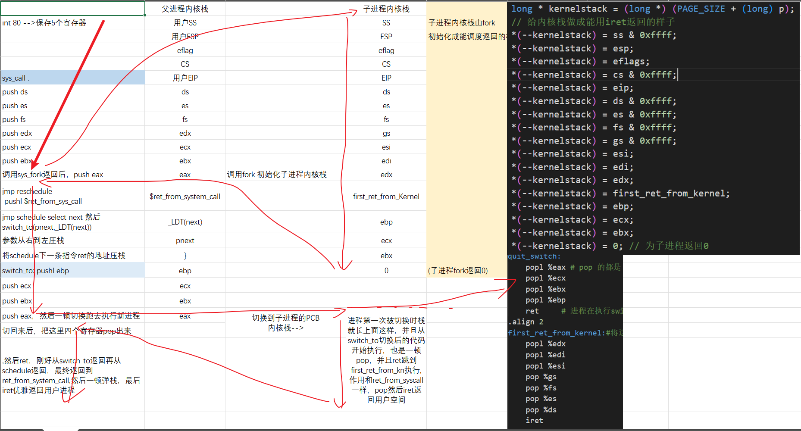

# 基于内核/用户堆栈实现进程切换

### 原有实现

原来使用tss + ljmp 实现switch_to

### 基于堆栈的实现

梳理一下整个过程：

1.某个中断发生，硬件自动保存若干寄存器到内核栈

2.system_call 函数执行，调用 对应的处理函数do_sys_call

3.do_sys_call。

4.schedule。看情况一般会进行调度，将用户栈和内核栈切换为目标进程的栈，ldt也要切换，切换之后就跑到其他进程执行了，等下次从其他进程切换回来，就会执行当前进程switch_to返回后的代码

5.ret_from_syscall

我们要使用内核栈，内核栈的数据结构已经有实现了，只需要加以利用即可

接下来就要具体研究分析，用户进程的内核栈的生命周期，这样才能正确使用

阅读fork

```
    struct task_struct *p;

    p = (struct task_struct *) get_free_page(); // 为新进程的pcb申请一页内存
  
    p->tss.esp0 = PAGE_SIZE + (long) p; // 核心！ 设置新进程的内核栈指针指向pcb所在页的顶部

    p->tss.ss0 = 0x10; // 内核栈的段选择子 ，其实就是内核的数据段
```

可知每个任务都有内核栈，由其pcb中tss的ss0和esp0指定，具体来说，任务的内核栈处在其pcb页面的顶端。

cpu中有个寄存器TR来保存当前进程的tss的gdt段选择子。因此cpu可以访问tss。

tss.ss0 和 tss.esp0对cpu来说是只读的，因此每次进程从用户态切换到内核态时，其内核栈都是空的

每当中断发生需要切换特权级到用户态时，cpu会自动往空的内核栈中push以下内容



使用堆栈进行进程切换，而不使用tss，故而不再需要为每个进程搞一个tss了，进程的状态和控制数据都放在pcb和对应内核栈中，故而switch_to()也不需要传目标进程的tss在GDT的选择子，而是传目标进程的pcb和ldt在GDT的选择子:

```assemble
extern void switch_to(struct task_struct *pnext,int ldtss);
```

新建一个switch_to.s 实现自定义切换函数。首先要保存ebp寄存器，接下来要取出表示下一个进程 PCB 的参数，并和 `current` 做一个比较：

通过fork系统调用的父子进程栈示意图




如果等于 current，则什么也不用做；

如果不等于 current，就开始进程切换，依次完成

1. PCB 的切换
2. TSS 中的内核栈指针的重写,因为cpu中断处理需要根据TR寄存器找到tss再找到内核栈来保存用户进程信息，因此虽然我们不使用tss做进程切换，也还是要维护一个全局的tss，即任务0的tss,所有进程都共用这个tss。任务0的tss指针已经定义好了，类比current.
3. 内核栈的切换。将寄存器 esp（内核栈使用到当前情况时的栈顶位置）的值保存到当前 PCB 中，再从目标 PCB 中的对应位置上取出保存的内核栈栈顶放入 esp 寄存器，这样处理完以后，再使用内核栈时使用的就是目标进程的内核栈了。不过原本的pcb中并没有内核栈指针域，因此需要修改，注意，在一些汇编文件中使用到了pcb，并且是硬编码使用的，因此修改pcb后需要在硬编码引用的地方做对应修改。包括0号进程初始化时的pcb
4. LDT 的切换
5. PC 指针（即 CS:EIP）的切换。具体实现见switch_to.s

接下来要修改fork。对 fork() 的修改就是对子进程的内核栈的初始化,

要把进程的用户栈、用户程序和其内核栈通过压在内核栈中的 `SS:ESP`，`CS:IP` 关联在一起。
